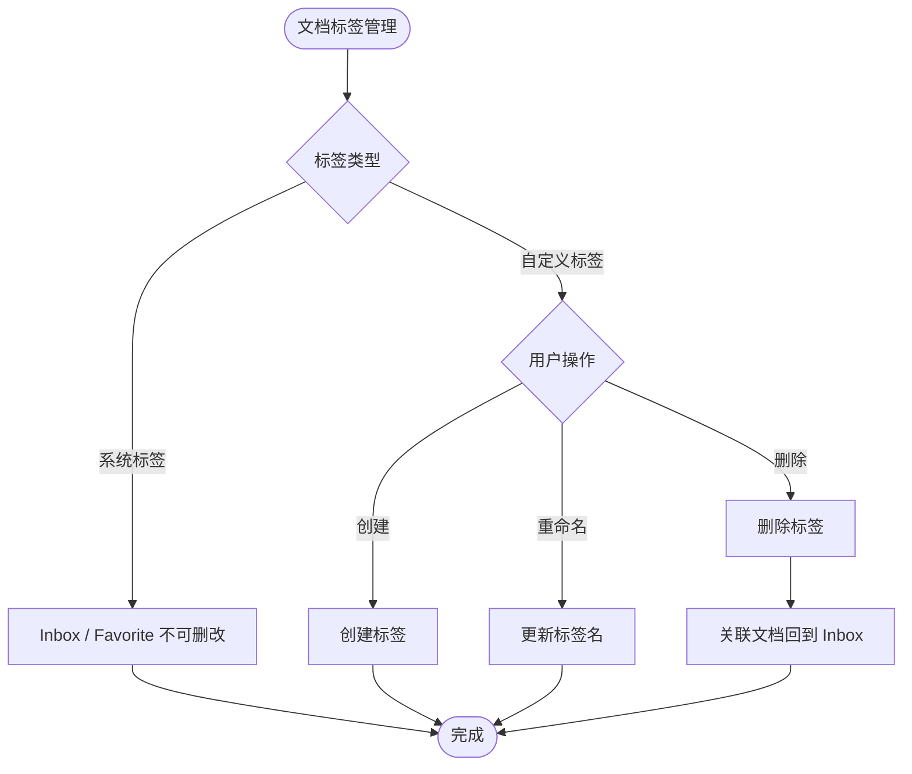

## 文档标签管理流程

下面的样例用于验证 Mermaid flowchart 能被识别为独立图表，并渲染出开始节点、判断节点、操作分支和结束节点。

```mermaid
flowchart TD
    A([文档标签管理]) --> B{标签类型}
    B -->|系统标签| C[Inbox / Favorite 不可删改]
    B -->|自定义标签| D{用户操作}
    D -->|创建| E[创建标签]
    D -->|重命名| F[更新标签名]
    D -->|删除| G[删除标签]
    G --> H[关联文档回到 Inbox]
    C --> I([完成])
    E --> I
    F --> I
    H --> I
```

## 预期效果

- 系统标签与自定义标签分支清晰可见
- 创建、重命名、删除操作连线能够显示标签
- 删除后关联文档回到默认分类
